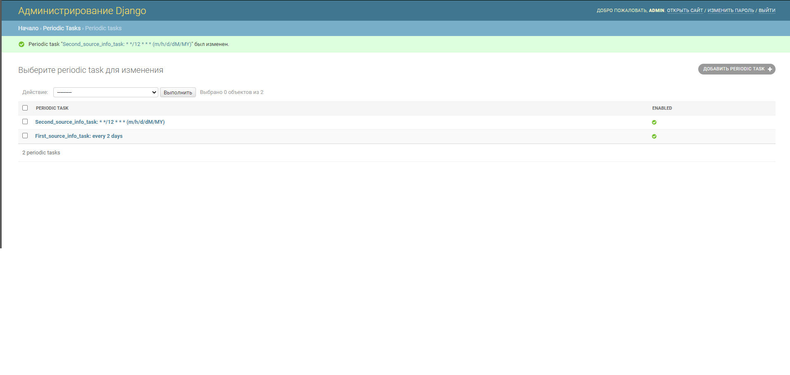
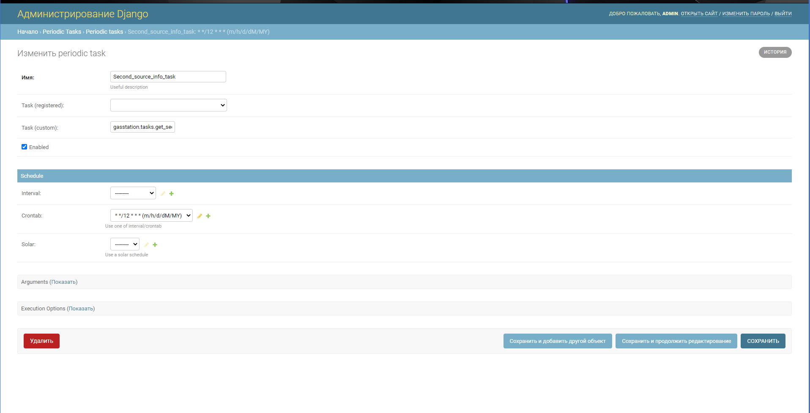
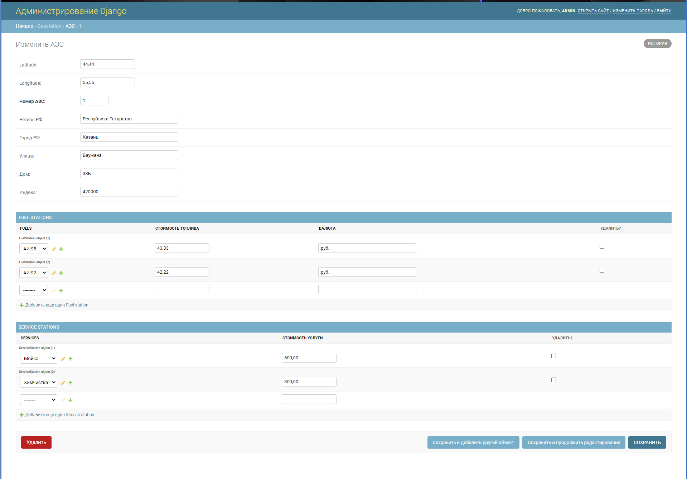
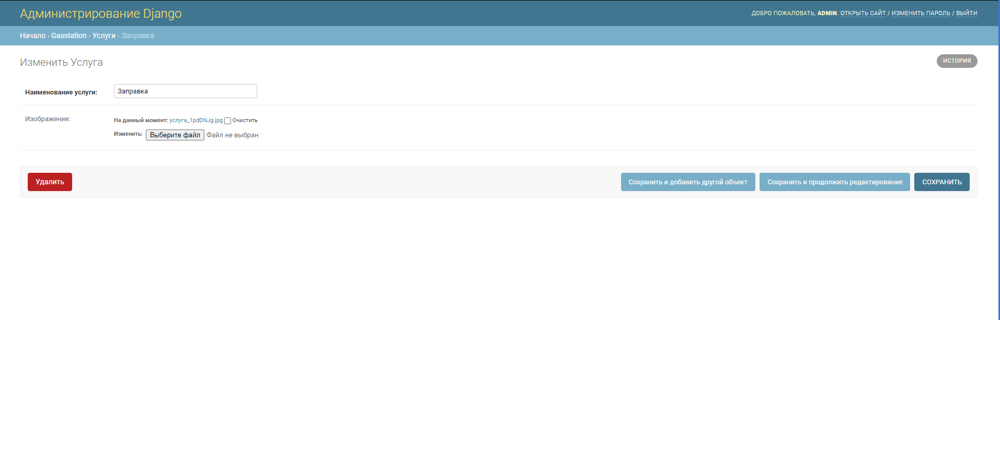
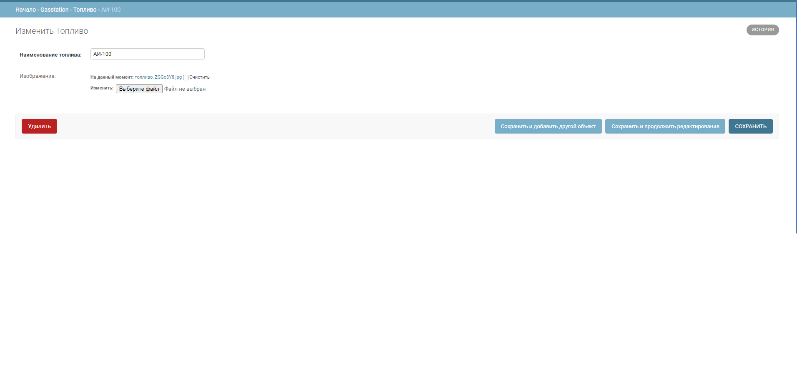

Реализация проекта по заданию "ТатИТнефть"
=====================
Для взаимодействия с API была реализована схема.

Ссылка на схему API в Postman -> https://documenter.getpostman.com/view/10965111/SztK14qk

Через административный сайт 127.0.0.1:8000/admin можно осуществлять:

* Создание и изменение периодических задач на получение информации
из источников




* Создание и изменение всех существующих моделей по проекту







-----------------------------------
Для запуска проекта необходимо
-----------------------------------
Установить зависимости:

```bash
pip install -r requirements.txt
```

Выполнить следующие команды:

* провести миграции
```bash
python manage.py migrate
```

* Создать тестового суперпользователя для входа на административный сайт:
```bash
python manage.py createsuperuser
```

* запустить отладочный веб-сервер проекта:
```bash
python manage.py runserver
```